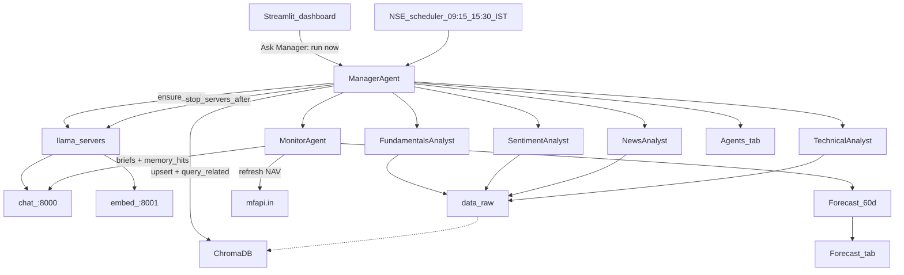
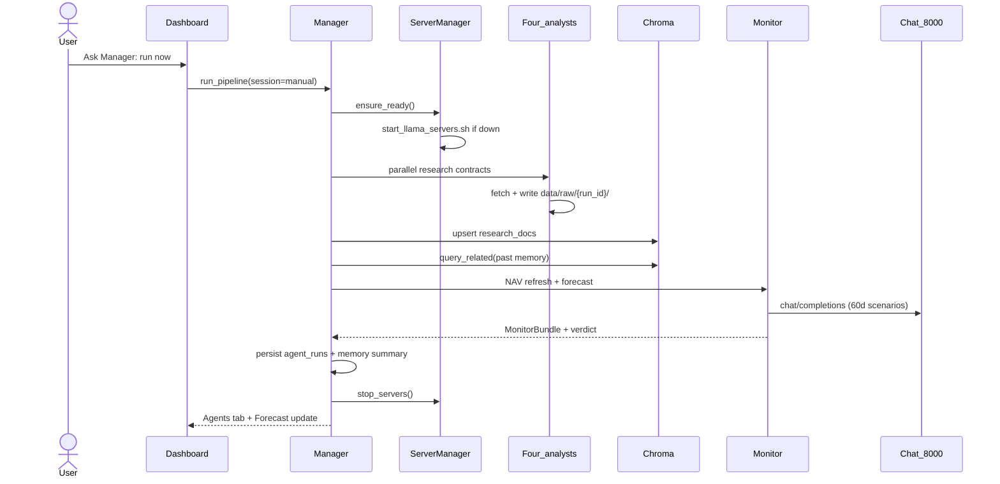
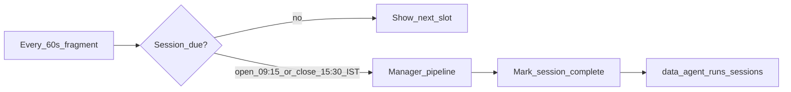
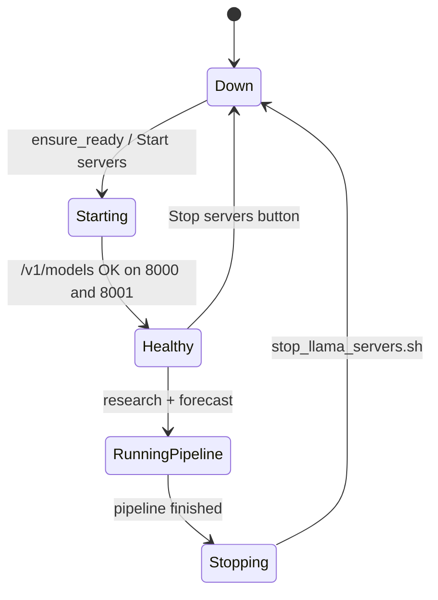
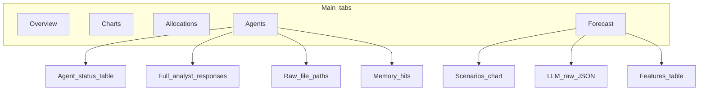
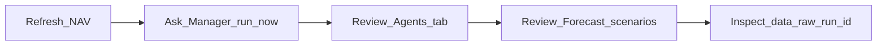

# RevOps — Kotak Multicap Portfolio Tracker

Interactive Streamlit app for tracking **Kotak Multicap Fund - Regular Plan - Growth** (scheme `149182`), with a **Manager-orchestrated multi-analyst research pipeline**, **Chroma memory**, and a **local LLM 60-day NAV scenario forecast**.

> Research and scenario forecasts only — **not investment advice**. Past performance does not guarantee future results.

---

## What it does

| Area | Capability |
|------|------------|
| **Portfolio** | NAV history (mfapi.in), P&L, ROI, CAGR, drawdown, allocations |
| **Research** | Four analysts: Fundamentals, Sentiment, News, Technical |
| **Memory** | Raw JSON under `data/raw/`, Chroma vectors, run summaries |
| **Forecast** | Bull / base / bear 60-day NAV paths via local chat LLM |
| **Servers** | Manager starts chat `:8000` + embed `:8001`, stops them after each LLM run |

---

## Architecture



---

## Interactive flows

### 1. Ask Manager: run now



### 2. Scheduled NSE open / close



- Weekdays only (Asia/Kolkata).
- Skips if that trade date + session already completed.
- Manual runs use `session=manual` and **do not** mark open/close complete.

### 3. Server lifecycle



| Endpoint | Role | Model (default path) |
|----------|------|----------------------|
| `http://127.0.0.1:8000/v1` | Chat completions | Gemma GGUF via llama-server |
| `http://127.0.0.1:8001/v1` | Embeddings only | nomic-embed GGUF (`--embedding`) |

Chat is **never** used for embeddings.

### 4. Dashboard tabs



---

## Research analysts

| Analyst | Agent id | Data sources | Writes |
|---------|----------|--------------|--------|
| **Fundamentals** | `fundamentals_analyst` | Config allocations + yfinance peer `info` | `data/raw/.../fundamentals/` |
| **Sentiment** | `sentiment_analyst` | Reddit public JSON + RAG/VADER | `data/raw/.../sentiment/` |
| **News** | `news_analyst` | Google News RSS (+ optional NewsAPI) | `data/raw/.../news/` + RAG JSONL |
| **Technical** | `technical_analyst` | yfinance OHLCV (Nifty, VIX, Bank Nifty, IT) | `data/raw/.../technical/` |

**Monitor** refreshes NAV from mfapi.in, builds features, and requests a **60-day** bull/base/bear forecast with research briefs + Chroma memory hits in context.

---

## Data layout

```
data/
├── raw/
│   └── {run_id}/                 # one folder per pipeline run
│       ├── meta.json             # session, statuses, timestamps
│       ├── fundamentals/         # yfinance info JSON
│       ├── sentiment/            # reddit + rag_hits JSON
│       ├── news/                 # RSS / NewsAPI payloads
│       └── technical/            # OHLCV history JSON
├── memory/
│   └── summaries.jsonl           # human-readable run summaries
├── chroma_store/                 # Chroma persistent DB
│                                 # collections: research_docs, memories
├── rag/
│   └── documents.jsonl           # chunked news/social for BM25
├── agent_runs/
│   ├── {run_id}.json             # full ManagerVerdict snapshot
│   └── sessions.jsonl            # scheduled open/close completion
└── docs/                         # optional local .txt/.md/.csv to ingest
```

### Fund snapshot (config)

| Field | Value |
|-------|--------|
| Scheme | `149182` |
| Name | Kotak Multicap Fund - Regular Plan - Growth |
| Inception | 2021-09-29 |
| Default holding | ₹99,995 @ NAV 20.30 |

Edit holdings and sector weights in [`utils/config.py`](utils/config.py).

---

## Project layout

```
revops/
├── dashboard.py              # Streamlit UI
├── requirements.txt
├── scripts/
│   ├── start_llama_servers.sh
│   └── stop_llama_servers.sh
├── agents/
│   ├── manager.py            # orchestration + server lifecycle
│   ├── monitor.py
│   ├── scheduler.py
│   ├── server_manager.py
│   ├── contracts.py          # Pydantic contracts
│   ├── fetchers/             # news, social, market
│   ├── research/             # four analysts
│   ├── memory/               # raw store, Chroma, summarizer
│   └── rag/                  # BM25 + semantic hybrid
├── utils/                    # config, nav, llm, embeddings, charts
├── data/                     # runtime artifacts (gitignored)
└── log/                      # llama-server pid + logs
```

---

## Setup guide

### Prerequisites

- Python **3.11+** (3.14 works with the project venv)
- [llama.cpp](https://github.com/ggerganov/llama.cpp) built with `llama-server`
- Chat GGUF (e.g. Gemma) and embedding GGUF (e.g. nomic-embed)
- Network access for mfapi, yfinance, Google News RSS, Reddit

### 1. Clone and virtualenv

```bash
cd /path/to/revops
python3 -m venv .venv
source .venv/bin/activate
pip install -r requirements.txt
```

### 2. Point scripts at your models

Defaults live in `scripts/start_llama_servers.sh`. Override as needed:

```bash
export LLAMA_SERVER=/path/to/llama.cpp/build/bin/llama-server
export CHAT_MODEL=/path/to/your-chat.gguf
export EMBED_MODEL=/path/to/your-nomic-embed.gguf
export CHAT_PORT=8000
export EMBED_PORT=8001
export NGL=99                    # GPU layers for chat; embed uses -ngl 0
export EMBED_BATCH_SIZE=2048     # helps long news snippets
```

Optional secrets / env:

| Variable | Purpose |
|----------|---------|
| `NEWS_API_KEY` | Optional NewsAPI enrichment |
| `REDDIT_USER_AGENT` | Polite Reddit UA (default is fine) |
| `LLM_BASE_URL` | Override chat base (`http://127.0.0.1:8000/v1`) |
| `EMBEDDING_BASE_URL` | Override embed base (`http://127.0.0.1:8001/v1`) |

Streamlit secrets (optional): `.streamlit/secrets.toml` — same keys if you prefer not to use env.

### 3. Start the dashboard

Manager will start/stop llama servers around LLM runs. You can also manage them from the sidebar.

```bash
source .venv/bin/activate
streamlit run dashboard.py
```

Open the URL Streamlit prints (usually `http://localhost:8501`).

### 4. First-run checklist

1. Sidebar → confirm chat / embed URLs (defaults `:8000` / `:8001`).
2. **Load / refresh NAV** (or wait for auto-load).
3. Toggle **Use local LLM** on.
4. Click **Ask Manager: run now**.
5. Open the **Agents** tab for statuses, briefs, raw paths, memory hits.
6. Open **Forecast** for scenarios and raw LLM JSON.

Heartbeat badges refresh about every 60s. After a Manager run, servers should show down until the next LLM pipeline (or manual **Start servers**).

### 5. Manual server control

```bash
# Start both
./scripts/start_llama_servers.sh

# Stop both
./scripts/stop_llama_servers.sh
```

Or use sidebar **Start servers** / **Stop servers**.

---

## Typical usage



- **Ask Manager: run now** — full research + memory + 60-day forecast; ignores NSE clock.
- **Run forecast only** — NAV features → LLM (or statistical baseline if LLM toggle off); no analysts. Start servers manually if LLM is on and Manager has already stopped them.
- **Scheduled research** — automatic at NSE open **09:15** and close **15:30** IST on weekdays.

---

## Guardrails

- Pydantic contracts for briefs / verdicts / memory hits
- No fabricated guarantee language in claims
- Prefer allowlisted news domains
- Embeddings refused if URL equals chat base
- LLM forecast failures raise (no silent statistical substitute when LLM is on)
- Disclaimer forced on user-facing summaries

---

## Troubleshooting

| Symptom | Likely cause | Fix |
|---------|--------------|-----|
| Chat / embed heartbeat failed | Servers down | **Ask Manager** (auto-start) or **Start servers** |
| `chroma_upsert` / embeddings 500 | Input too long for llama batch | Truncation is client-side; ensure `EMBED_BATCH_SIZE=2048` and embed server restarted |
| Reddit / news empty | Network or rate limit | Check `data/raw/.../meta` and agent metrics errors |
| Forecast fails with LLM on | Chat server or bad JSON | Check `log/llama_chat.log`; Agents tab guardrail hits |
| Schedule never fires | Weekend or already completed | Check sidebar “Next slot” / last completed |

Logs: `log/llama_chat.log`, `log/llama_embed.log`.

---

## Disclaimer

Outputs are **research briefs and scenario forecasts** for personal tooling — not personalized investment advice, solicitations, or guarantees of return.
