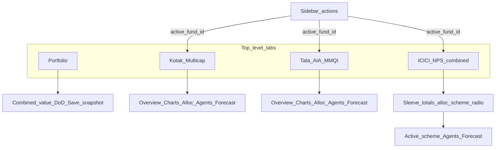
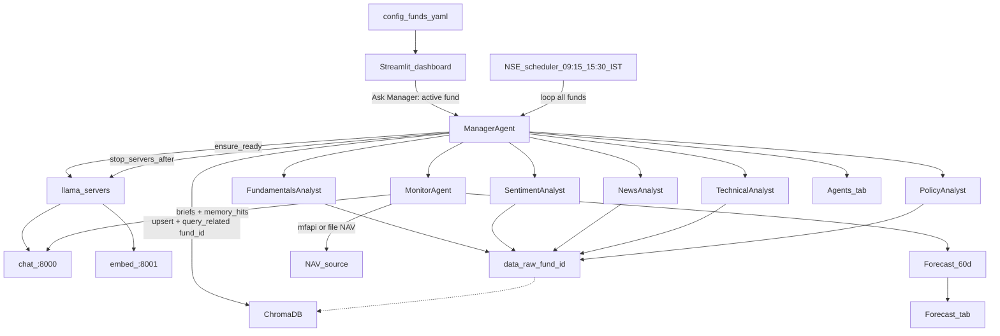
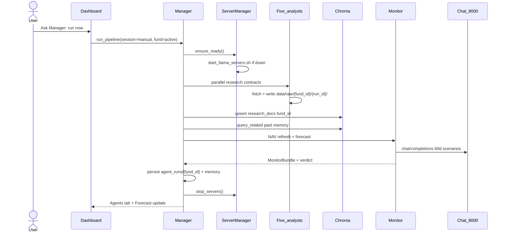
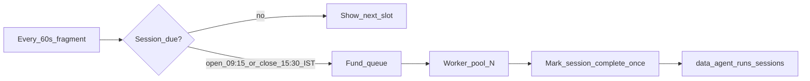
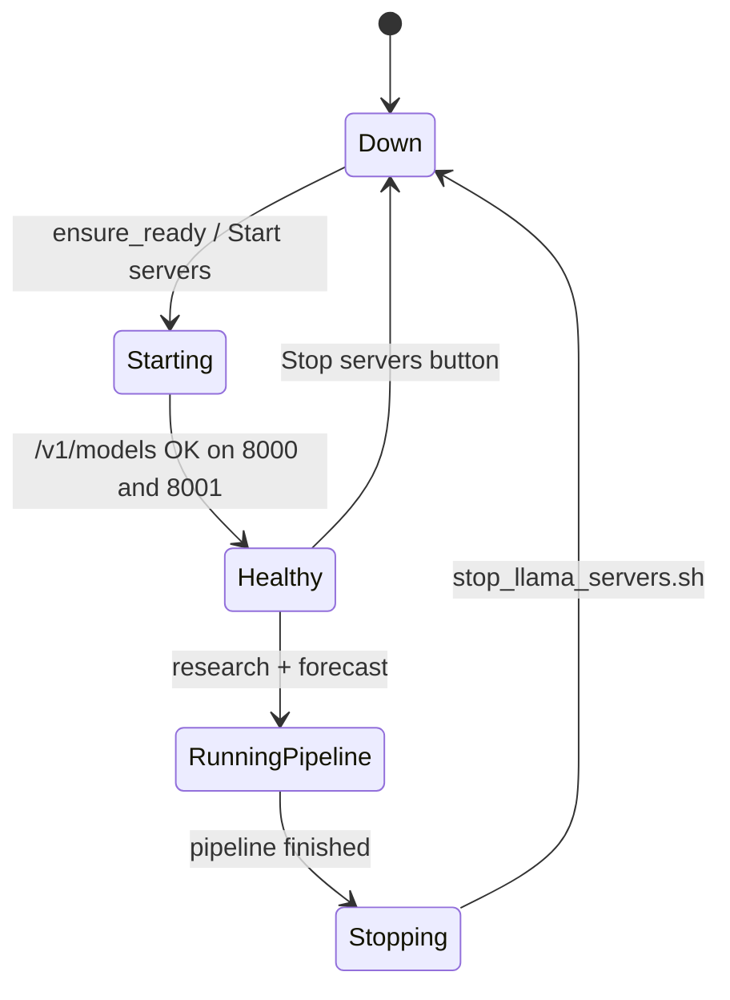
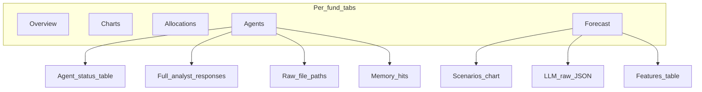
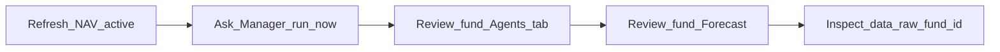

# RevOps — Multi-fund Portfolio Tracker

Interactive Streamlit app for tracking **multiple funds** from [`config/funds.yaml`](config/funds.yaml), with a **Manager-orchestrated multi-analyst research pipeline** (including policy/regulation), **Chroma memory**, and **bootstrap + optional LLM-refined trading-day NAV scenarios**.

Default funds:

| Fund | Type | NAV source | Identifier |
|------|------|------------|------------|
| Kotak Multicap Fund - Regular Plan - Growth | Mutual fund | mfapi.in | Scheme `149182` |
| Tata AIA Multicap Momentum Quality Index Fund | ULIP | Local CSV | SFIN `ULIF 078 31/12/24 MQI 110` |
| ICICI Prudential Pension Fund — Scheme E | NPS | Local CSV | `icici_nps_e` |
| ICICI Prudential Pension Fund — Scheme C | NPS | Local CSV | `icici_nps_c` |
| ICICI Prudential Pension Fund — Scheme G | NPS | Local CSV | `icici_nps_g` |

> Research and scenario forecasts only — **not investment advice**. Past performance does not guarantee future results.

> **Kotak cost basis:** YAML keeps `investment: 99995` @ `purchase_nav: 20.30` (units ≈ 4925.86). A user book of 4926.833 units @ 20.18 (= ₹99,423) is close but not applied — leaving YAML as-is avoids breaking the tracked cost basis.

---

## What it does

| Area | Capability |
|------|------------|
| **Multi-fund** | YAML-driven funds; Portfolio tab + per-fund tabs; **ICICI NPS E/C/G share one combined dashboard tab** (`dashboard_group`) |
| **Portfolio** | Combined allocation, day-over-day vs prior snapshot, **Save today's snapshot**; per-fund NAV / P&L / ROI / CAGR |
| **Research** | Five analysts: Fundamentals, Sentiment, News, Technical, **Policy** |
| **Memory** | Raw JSON under `data/raw/{fund_id}/`, Chroma with `fund_id` metadata |
| **Forecast** | Bootstrap p10/p50/p90 trading-day paths (60 default); LLM refine clamped to baseline; walk-forward coverage |
| **Servers** | Manager starts chat `:8000` + embed `:8001`, stops them after each LLM run |

---

## Funds input file

Holdings and research hints live in [`config/funds.yaml`](config/funds.yaml). Loader: [`utils/funds.py`](utils/funds.py) (`FundConfig`, optional `dashboard_group` / `group_id` / `ui_group`, `iter_dashboard_entries()`, `load_funds()`, `units = investment / purchase_nav`).

```yaml
funds:
  - id: kotak_multicap
    name: Kotak Multicap Fund - Regular Plan - Growth
    type: mutual_fund
    scheme_code: "149182"
    nav_source: mfapi
    investment: 99995.00
    purchase_nav: 20.30
    benchmark_symbol: "^NSEI"
    # sectors, research_queries, …

  - id: tata_aia_mmqi
    name: Tata AIA Multicap Momentum Quality Index Fund
    type: ulip
    sfin: "ULIF 078 31/12/24 MQI 110"
    nav_source: file
    nav_file: data/nav/tata_aia_mmqi.csv
    investment: 44741.01
    purchase_nav: 9.3108
    benchmark_symbol: "^NSEI"

  - id: icici_nps_e
    type: nps
    nav_source: file
    nav_file: data/nav/icici_nps_e.csv
    investment: 72482.51
    purchase_nav: 74.2416
```

### NAV sources

| `nav_source` | Behavior |
|--------------|----------|
| `mfapi` | Public scheme history via mfapi.in (`scheme_code`) |
| `file` | CSV at `nav_file` with columns `Date,NAV` (ISO dates) |

**ULIP note:** Tata AIA Multicap Momentum Quality is a life-insurance ULIP, not an AMFI mutual fund — there is **no** mfapi scheme code. Maintain NAV by appending rows to [`data/nav/tata_aia_mmqi.csv`](data/nav/tata_aia_mmqi.csv). Seeded with purchase NAV **9.3108** (investment ₹44,741.01).

**NPS note:** ICICI Prudential Pension Fund schemes **E / C / G** use `type: nps` and `nav_source: file`. Seeded CSVs:

| File | Seed NAV (2026-09-06) | Investment |
|------|----------------------|------------|
| [`data/nav/icici_nps_e.csv`](data/nav/icici_nps_e.csv) | 74.2416 | ₹72,482.51 |
| [`data/nav/icici_nps_c.csv`](data/nav/icici_nps_c.csv) | 46.5038 | ₹42,396.07 |
| [`data/nav/icici_nps_g.csv`](data/nav/icici_nps_g.csv) | 38.6797 | ₹28,277.69 |

Append a new `YYYY-MM-DD,<nav>` row each day after PFRDA / CRA publishes the NAV (same `Date,NAV` header as Tata).

**Dashboard grouping:** the three ICICI NPS schemes set `dashboard_group: icici_nps` in YAML so the UI shows **one** combined sleeve tab — **ICICI Prudential NPS (E+C+G)** — instead of three separate top-level fund tabs. Portfolio snapshots still store each scheme individually.

**Forecasting requires ≥60 NAV observations.** Until a file-NAV fund (Tata / NPS) has enough rows, Ask Manager / Run forecast only will refuse that fund with a clear error (“Need ≥60 NAV rows for forecast.”). Per-fund tabs still work for overview / allocations.

### Reliable forecasting

| Piece | Behavior |
|-------|----------|
| Horizon | **Trading days** (business calendar); UI 30 / 60 / 90 |
| Baseline | Bootstrap (500 paths) from shrunk daily returns; bear/base/bull = **p10 / p50 / p90** |
| Gate | `< 60` observations → block forecast |
| Benchmark | `benchmark_symbol` in YAML (default `^NSEI`); beta / residual vol attached to features |
| LLM | Optional refine within **±25% of half (bull−bear)** around each baseline terminal; ordered scenarios; otherwise **fallback to bootstrap** (raw LLM kept) |
| Backtest | Walk-forward every 21 days; coverage % + median abs % error of base shown in Forecast tab |
| Features NAV | Always **full** history (date filter is for charts only) |

---

## Dashboard layout



- First tab **Portfolio**: combined total, interactive allocation viz, day-over-day vs previous snapshot, **Save today's snapshot**, snapshot date history.
- Ungrouped funds (Kotak, Tata) each get a **main tab**.
- **ICICI NPS E / C / G** share one combined tab (`dashboard_group: icici_nps`) with sleeve totals, allocation pie, scheme table, and an inner radio for research/forecast focus (default Scheme E).
- Inside each fund workspace: Overview / Charts / Allocations / Agents / Forecast.
- Sidebar **Ask Manager / Load NAV / Forecast** apply to the **active** fund (sidebar selectbox; ICICI entries labeled under the NPS sleeve).
- Scheduled NSE open/close runs the Manager pipeline for **all funds** (still three ICICI holdings in snapshots).
- **UI refresh:** dark cyan/teal theme, subtle CSS motion on metrics/cards/banners, richer Altair tooltips / hover highlight / legend toggle — Streamlit + CSS + Altair only.

---

## Architecture



---

## Interactive flows

### 1. Ask Manager: run now (active fund)



### 2. Scheduled NSE open / close



- Weekdays only (Asia/Kolkata).
- Queues **all** funds; at most `max_parallel_calls` pipelines run at once (default **1**).
- Servers start once before the batch and stop once after.
- Marks the session complete once if any fund accepted.
- Manual runs use `session=manual` and **do not** mark open/close complete.

### 3. Server lifecycle



| Endpoint | Role | Model (default path) |
|----------|------|----------------------|
| `http://127.0.0.1:8000/v1` | Chat completions | Gemma GGUF via llama-server |
| `http://127.0.0.1:8001/v1` | Embeddings only | nomic-embed GGUF (`--embedding`) |

Chat is **never** used for embeddings.

### 4. Nested fund workspace tabs



---

## Research analysts

| Analyst | Agent id | Data sources | Writes |
|---------|----------|--------------|--------|
| **Fundamentals** | `fundamentals_analyst` | Fund allocations + yfinance peer `info` | `data/raw/{fund_id}/.../fundamentals/` |
| **Sentiment** | `sentiment_analyst` | Reddit public JSON + RAG/VADER | `.../sentiment/` |
| **News** | `news_analyst` | Google News RSS (+ optional NewsAPI) | `.../news/` |
| **Technical** | `technical_analyst` | yfinance OHLCV (Nifty, VIX, Bank Nifty, IT) | `.../technical/` |
| **Policy** | `policy_analyst` | SEBI / RBI / **IRDAI** / Budget / tax (RSS + NewsAPI); fund-type-aware queries | `.../policy/` |

**Monitor** refreshes NAV (mfapi or file), builds features + benchmark beta, runs a **bootstrap trading-day** bull/base/bear forecast (optional LLM refine with clamps), and attaches walk-forward backtest metrics when history allows.

---

## Data layout

```
data/
├── nav/
│   ├── tata_aia_mmqi.csv         # ULIP file NAV (append Date,NAV rows)
│   ├── icici_nps_e.csv           # NPS Scheme E file NAV
│   ├── icici_nps_c.csv           # NPS Scheme C file NAV
│   └── icici_nps_g.csv           # NPS Scheme G file NAV
├── snapshots/
│   ├── .gitkeep
│   └── 2026-09-06.json           # seeded daily portfolio snapshot (others gitignored)
├── raw/
│   └── {fund_id}/
│       └── {run_id}/             # one folder per pipeline run
│           ├── meta.json
│           ├── fundamentals/
│           ├── sentiment/
│           ├── news/
│           ├── technical/
│           └── policy/
├── memory/
│   └── summaries.jsonl
├── chroma_store/                 # metadata includes fund_id
├── rag/
│   └── documents.jsonl
├── agent_runs/
│   ├── sessions.jsonl            # scheduled open/close completion
│   └── {fund_id}/
│       └── {run_id}.json
└── docs/                         # optional local .txt/.md/.csv to ingest
```

Edit holdings, sectors, and research queries in [`config/funds.yaml`](config/funds.yaml) — not in `utils/config.py` (that file keeps LLM/server/path globals only).

---

## Project layout

```
revops/
├── dashboard.py              # Multi-fund Streamlit UI
├── config/
│   └── funds.yaml            # Fund definitions
├── requirements.txt
├── scripts/
│   ├── start_llama_servers.sh
│   └── stop_llama_servers.sh
├── agents/
│   ├── manager.py            # orchestration + server lifecycle
│   ├── monitor.py
│   ├── scheduler.py
│   ├── server_manager.py
│   ├── contracts.py
│   ├── fetchers/
│   ├── research/             # five analysts incl. policy
│   ├── memory/
│   └── rag/
├── utils/                    # funds, snapshots, config, nav, llm, charts
├── data/                     # runtime artifacts (gitignored; seed NAV tracked)
└── log/
```

---

## Setup guide

### Prerequisites

- Python **3.11+** (3.14 works with the project venv)
- [llama.cpp](https://github.com/ggerganov/llama.cpp) built with `llama-server`
- Chat GGUF (e.g. Gemma) and embedding GGUF (e.g. nomic-embed)
- Network access for mfapi, yfinance, Google News RSS, Reddit

### 1. Clone and virtualenv

```bash
cd /path/to/revops
python3 -m venv .venv
source .venv/bin/activate
pip install -r requirements.txt
```

### 2. Point scripts at your models

Defaults live in `scripts/start_llama_servers.sh`. Override as needed:

```bash
export LLAMA_SERVER=/path/to/llama.cpp/build/bin/llama-server
export CHAT_MODEL=/path/to/your-chat.gguf
export EMBED_MODEL=/path/to/your-nomic-embed.gguf
export CHAT_PORT=8000
export EMBED_PORT=8001
export NGL=20                     # iGPU/16GB-safe; raise to 28–36 if stable (NOT 99)
export CHAT_CTX=4096              # was 64000 — too large for shared iGPU RAM
export EMBED_BATCH_SIZE=2048     # helps long news snippets
```

Optional secrets / env:

| Variable | Purpose |
|----------|---------|
| `NEWS_API_KEY` | Optional NewsAPI enrichment |
| `REDDIT_USER_AGENT` | Polite Reddit UA (default is fine) |
| `LLM_BASE_URL` | Override chat base (`http://127.0.0.1:8000/v1`) |
| `EMBEDDING_BASE_URL` | Override embed base (`http://127.0.0.1:8001/v1`) |
| `REVOPS_MAX_PARALLEL_CALLS` | Max concurrent fund pipelines **and** research analysts (default **1** = fully queued for local llama) |

Sidebar **Max parallel calls** (1–5) overrides the env default for the current session without restarting.

Streamlit secrets (optional): `.streamlit/secrets.toml` — same keys if you prefer not to use env.

### 3. Start the dashboard

```bash
source .venv/bin/activate
streamlit run dashboard.py
```

Open the URL Streamlit prints (usually `http://localhost:8501`).

### 4. First-run checklist

1. Sidebar → pick **active fund** (sidebar actions target this fund).
2. Confirm chat / embed URLs (defaults `:8000` / `:8001`).
3. **Load / refresh NAV** (or wait for auto-load per fund tab).
4. Toggle **Use local LLM** on.
5. Click **Ask Manager: run now** (active fund only).
6. Open that fund’s **Agents** / **Forecast** tabs.
7. For Tata AIA ULIP / ICICI NPS: append NAV rows to the matching `data/nav/*.csv` until you have **≥60** points before forecasting.
8. Open the **Portfolio** tab → review combined value → **Save today's snapshot** (writes `data/snapshots/YYYY-MM-DD.json`).

Heartbeat badges refresh about every 60s. After a Manager run, servers should show down until the next LLM pipeline (or manual **Start servers**).

### 5. Manual server control

```bash
./scripts/start_llama_servers.sh
./scripts/stop_llama_servers.sh
```

Or use sidebar **Start servers** / **Stop servers**.

---

## Typical usage



- **Ask Manager: run now** — full research + memory + trading-day scenario forecast for the **active** fund; ignores NSE clock. Analyst fan-out respects **Max parallel calls**.
- **Run forecast only** — active fund only; bootstrap (± LLM) on **full** NAV; no analysts.
- **Scheduled research** — automatic at NSE open **09:15** and close **15:30** IST; **all funds** queued with the same concurrency limit.
- **Save today's snapshot** (Portfolio tab) — persist combined holdings + total under `data/snapshots/` for day-over-day.

---

## Guardrails

- Pydantic contracts for briefs / verdicts / memory hits
- No fabricated guarantee language in claims
- Prefer allowlisted news domains (incl. `irdai.gov.in`, `incometax.gov.in` for policy)
- Embeddings refused if URL equals chat base
- LLM refine is clamped to the bootstrap band; irreparable output **falls back to bootstrap** (raw response retained)
- Forecast blocked when NAV observations < 60
- Disclaimer forced on user-facing summaries
- **Max parallel calls** (default 1) queues multi-fund schedules and caps analyst fan-out so local llama is not overloaded

---

## Troubleshooting

| Symptom | Likely cause | Fix |
|---------|--------------|-----|
| Chat / embed heartbeat failed | Servers down | **Ask Manager** (auto-start) or **Start servers** |
| `chroma_upsert` / embeddings 500 | Input too long for llama batch | Ensure `EMBED_BATCH_SIZE=2048` and embed server restarted |
| Forecast fails / blocked | <60 NAV rows (common for Tata file NAV) | Append `Date,NAV` rows; check Forecast error banner |
| Forecast fails with LLM on | Chat server or bad JSON | Falls back to bootstrap; check `log/llama_chat.log` / LLM response tab |
| Tata AIA empty / stale NAV | File not updated | Append `Date,NAV` to `data/nav/tata_aia_mmqi.csv` |
| NPS empty / stale NAV | File not updated | Append `Date,NAV` to `data/nav/icici_nps_{e,c,g}.csv` |
| No day-over-day on Portfolio | Only one snapshot | Save today's snapshot on consecutive days |
| Reddit / news empty | Network or rate limit | Check `data/raw/{fund_id}/.../meta` |
| Schedule never fires | Weekend or already completed | Check sidebar “Next slot” / last completed |

Logs: `log/llama_chat.log`, `log/llama_embed.log`.

---

## Disclaimer

Outputs are **research briefs and scenario forecasts** for personal tooling — not personalized investment advice, solicitations, or guarantees of return.
